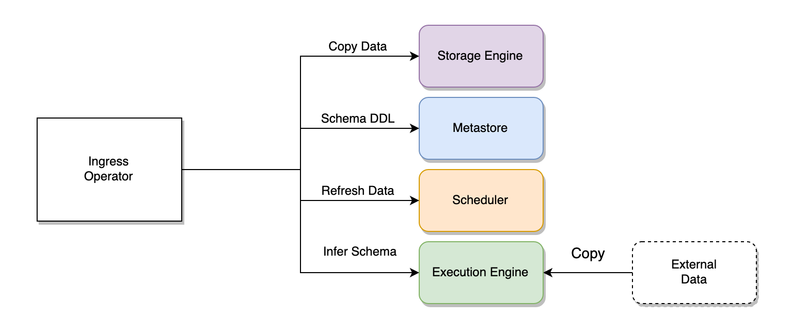
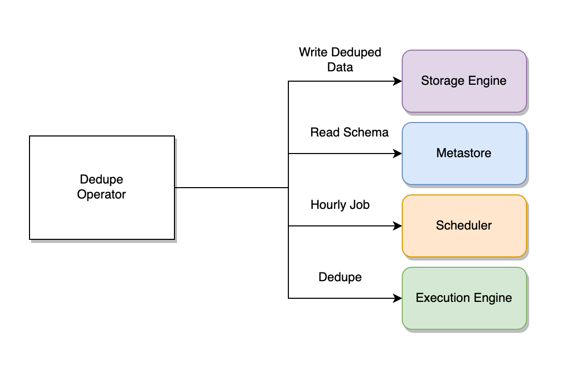
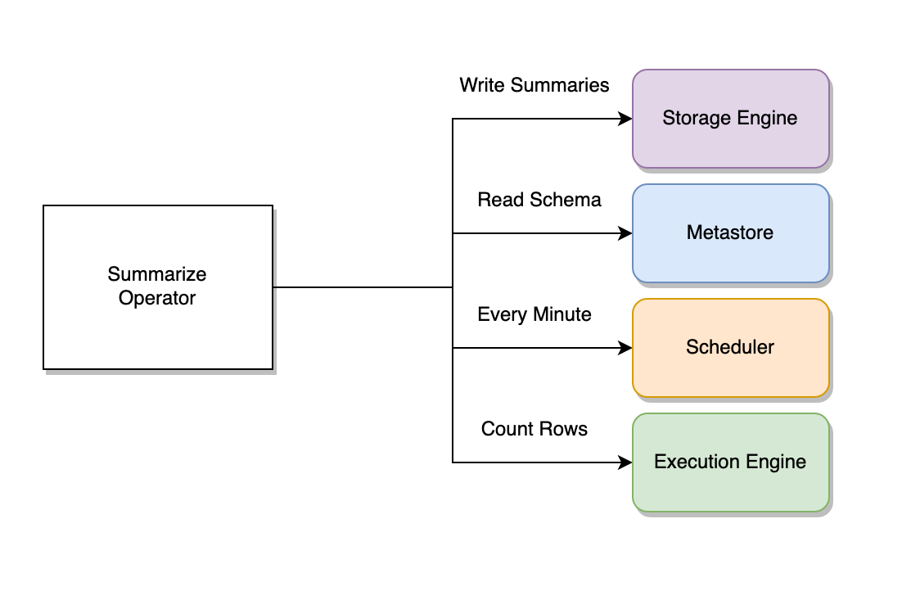
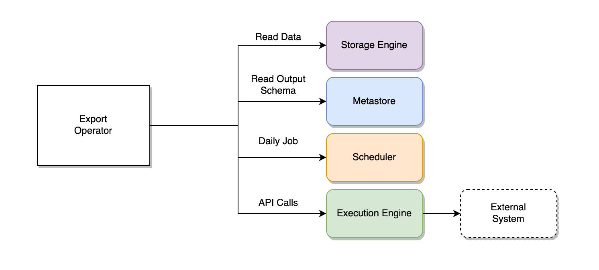

# Mason - Data Operator Framework  

Mason is the connecting tissue for your data projects.  You can think of Data Operators as a "data aware" analogue to the concept of an airflow operator, or a data analogue to the react.js concept of a "component".  In reality it specifies Data Operators which interact with 4 configuration abstractions called "Engines":


1.   Storage Engines - Any activity that involves serial (row level) access and storage of data.  Some example storage clients would be S3 or HDFS.
2.   Metastore Engines - Any activity that involves accessing metadata of datasets such as partitioning or schema information but not the data itself.  Some example metastore clients would be Glue, or Hive.
3.   Execution Engines - Any activity that involves programatic serial or SQL analytical computation on data.  Example exeuction engines would be spark, presto, or athena.
4.   Scheduler Engines -  Anything that involves scheduling frequency of data jobs.  Example scheduler clients would be airflow, or aws data pipelines

Mason is heavily inspired by language agnostic configuration driven tools like kubernetes, helm, and terraform.   Mason aims to help to make existing higher level open source big data tools _easier_ to coordinate with one another and make them easier to interact with for individuals of various expertise across organizations.  Mason does not attempt to make provisioning and standing up such services referenced in its configurations easier and thus is meant to be used in conjunction with tools
like kubernetes and helm.

Mason's mission is to provide ways to build composable self contained functional units called "Data Operators" which companies can stitch together to easily provide end to end data pipelines.   The target demographic of Mason are companies that are just breaking into the enterprise data space, or companies that are looking to consolidate their data operations.

## Quickstart
Local Development:
```
./install
```
Mason leverages `mypy` heavily for ensuring that function signatures and types are in line. Install will run mypy and stop if it does not succeed.  

To configure mason run `mason config`.  Configurations are validated for basic structure using json_schema.  See `configurations/schema.json`:
```
mason config examples/config/config_example.yaml
>>
Creating MASON_HOME at ~/.mason/
Creating OPERATOR_HOME at ~/.mason/operators/

Using config examples/config/config_example.yaml.  Saving to ~/.mason/config.yaml
+-------------------------------------------------+
| Reading configuration at ~/.mason/config.yaml:  |
+-------------------------------------------------+
{
 "metastore_config": "{'client': 'glue', 'configuration': {'region': 'us-east-1', 'aws_role_arn': 'arn:aws:iam::062325279035:role/service-role/AWSGlueServiceRole-anduin-data-glue'}}",
 "storage_config": "{'client': 's3', 'configuration': {'region': 'us-east-1'}}",
 "scheduler_config": "{'client': 'glue', 'configuration': {'region': 'us-east-1', 'aws_role_arn': 'arn:aws:iam::062325279035:role/service-role/AWSGlueServiceRole-anduin-data-glue'}}",
 "execution_config": "{}"
}
```

You will begin without any operators registered by default:
```
mason operator
>>
No Operators Registered.  Register operators by running "mason register"

```
  You can register some example operators.  Operators are validated for basic structure using json_schema.  See `/operators/schema.json` for the schema description.
```
mason register examples/operators/table
>>
Valid Operator Definition examples/operators/table/refresh/operator.yaml
Valid Operator Definition examples/operators/table/get/operator.yaml
Valid Operator Definition examples/operators/table/list/operator.yaml
Valid Operator Definition examples/operators/table/infer/operator.yaml
Registering operator(s) at examples/operators/table to ~/.mason/operators/table/
```
Listing Operators:
```
mason operator
>>
+--------------------------------------------------+
| Available Operator Methods: ~/.mason/operators/  |
+--------------------------------------------------+

namespace    command    description                                                                               parameters
-----------  ---------  ----------------------------------------------------------------------------------------  ----------------------------------------------------------------
table        refresh    Refresh metastore tables                                                                  {'required': ['database_name', 'table_name']}
table        get        Get metastore table contents                                                              {'required': ['database_name', 'table_name']}
table        list       Get metastore tables                                                                      {'required': ['database_name']}
table        infer      Registers a schedule for infering the table then does a one time trigger of the refresh.  {'required': ['database_name', 'storage_path', 'schedule_name']}

```
Listing Operators for a particular namespace:
```
mason operator table
```

Running operator with parameters argument:
```
mason operator table get -p database_name:crawler-poc,table_name:catalog_poc_data
>>
+--------------------+
| Parsed Parameters  |
+--------------------+
{'database_name': 'crawler-poc', 'table_name': 'catalog_poc_data'}

+-------------------------+
| Parameters Validation:  |
+-------------------------+
Validated: ['database_name', 'table_name']

+--------------------+
| Operator Response  |
+--------------------+
{
 "Errors": [],
 "Info": [],
 "Warnings": [],
 "Data": {
  "name": "catalog_poc_data",
  "created_at": "2020-02-26T12:57:31-05:00",
  "created_by": "arn:aws:sts::062325279035:assumed-role/AWSGlueServiceRole-anduin-data-glue/AWS-Crawler",
  "database_name": "crawler-poc",
  "schema": [...]
 }
}

```
Running operator with config parameters yaml file:

```
mason operator table get -c examples/parameters/table_get.yaml
>>
+--------------------+
| Operator Response  |
+--------------------+
{
 "Errors": [],
 "Info": [],
 "Warnings": [],
 "Data": {
  "name": "catalog_poc_data",
  "created_at": "2020-02-26T12:57:31-05:00",
  "created_by": "arn:aws:sts::062325279035:assumed-role/AWSGlueServiceRole-anduin-data-glue/AWS-Crawler",
  "database_name": "crawler-poc",
  "schema": [...]
 }
}
```


## Philosophy

Mason's main function is to broker the relationship between 3 main objects:
1. Clients -  Technologies which can be used in various capacities as engines
2. Engines -  The 4 main types of data operations (storage, execution, metastore and scheduler) which comprise of the main players in an operator definition.
3. Operators - Parameterized definitions of work which interact with the various engines.

## Engines 

Mason creates a layer of abstraction between these 4 engine types (storage, metastore, scheduler, execution) and the various clients that you could use to execute them.  

For example, S3 is primarily a storage engine but can also be leveraged as a metastore in accessing its partitioning (in this simple sense just the folder heirarchy) information.

Glue is primarily a metastore but can also be used in the capacity of a scheduler or even execution engine via glue crawlers.

## Clients

Clients are being added they include a number of prioprietary technologies such as Athena, Glue, Redshift but are mainly focused on open source technologies such as Presto, Airflow and Spark.

## Operators 

The main concept in mason is something called a "Data Operator".  You can think of there as being are three main types of Data Operators:

1.  Ingress Operators
2.  Transform Operators
3.  Egress Operators


### Defining Data Operators:
COMING SOON


### Example: Import Operator



### Example: Dedupe Operator



### Example: Summarize Operator



### Example: Export Operator


